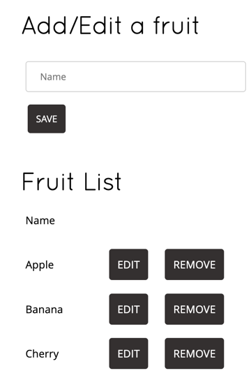

# Demo for using JeKa in conjunction with  Maven 

JeKa can be used for filling the missing features of other build tools

Here, we are using a Quarkus project built with Maven. the project is forked from https://github.com/domaframework/quarkus-sample.

This project consists in a native web app, that provides a GUI for managing a basket of fruits.



Initially, users that wanted to build and run this project had to fulfill some prerequisites, as installing a proper 
Graalvm JDK and setting needed environment variables.

Jeka comes to the rescue by providing full portability : 
  - it handles JDK installation if missing
  - It sets proper environment variables prior delegating the build to Maven

## Build and execute from anywhere

You can build and run the project, without having JeKa or any JDK installed on the host machine.

At root of the project, just execute :
```shell
./jeka build
```
This will produce the native Quarkus image, ready to run.
For this, JeKa does :
- Download needed JDK and JeKa version if needed
- Execute the Maven command `mvnw clean package -Pnative`, settings the relevant environment variables.

Once built, you can execute the native image by executing :
```shell
./jeka -p
```
Any arguments passed after the `-p` option will be passed as program arguments.

> [!TIP]
> You can omit the build phase by directly executing `jeka -p`. If the native executable is not found, JeKa 
> triggers a build to generate it.

## Run the application without cloning the repo

If you have JeKa installed on the host machine, the project can be executed transparently from its remote 
Git repo (no need to clone manually).

```shell
jeka -r https://github.com/jeka-dev/demo-maven-jeka-quarkus.git -p 
```

This command can be run from any location on your host machine. The initial execution may take longer due to the 
compilation process. However, following runs will be as fast as lightning.

## Deal in IDE

The setup and build phase are coded in [jeka-src/Script.java file](jeka-src/Script.java).
To edit it conveniently in Intellij, execute :
```shell
./jeka intellij: iml
```